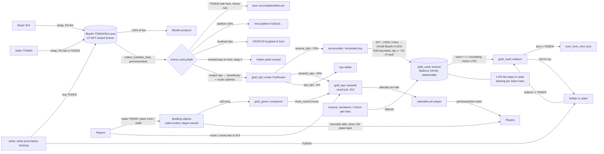

# The Gold Reserve on vicefun.com: Contract Scope

*Draft v0.3, Oct 6, 2026. Tagline: TBD ("Held forever." retired; proposal: "Redeemable in gold." See §4 "Also").*
*Labels: **[C]** = confirmed (source given), **[A]** = assumption, **[E]** = estimate.*

### Changelog

- **v0.3 (Oct 6, 2026)**
  - **Stake to build, not burn to build.** Placing a Gold Mine or Vault Shaft now *locks* `$RESERVE` inside an owned `Building` object. Players get the full stake back by demolishing after the round closes. Moves and surveys cost a small **SUI fee paid into the round's rewards pot** instead of a token burn (§2 Package 3, §8).
  - **Anti-exploit rules for staking:** score is time-weighted inside the round (anti flash-stake), stakes cannot leave before close (no flash loans, no double use across rounds), per-address stake escalation plus own-mine-only vein bonus (anti-whale / anti-sybil). Score is *not* weighted by stake size (§8.5).
  - **D1 decided: redeemable vault.** Any holder can burn `$RESERVE` for a pro-rata share of vault XAUm. Denominator = circulating supply, which excludes tokens sitting in the locked Bluefin LP position (§2 Package 1, §2.1). 1.5% redemption fee stays in the vault, plus a per-24h global cap and an opening gate. The "held forever / no withdraw" framing is removed.
  - **Router burn slice removed.** Suggested split goes from 70/15/10/5 to **75 reserve / 20 rewards / 0 burn / 5 ops**. `gold_ops::burner` dropped (D2).
  - **D5 is now required:** redemption needs the one-line Arena `mint_lock_total_supply` view.
  - Money-flow diagram, risks, build plan (**~5–7 weeks pre-audit**, up from 4–5.5) and decisions (new D9–D14) updated.
- v0.2: added the Compound skill game (burn-to-place), FeeRouter rewards leg, D6–D8.
- v0.1: vault + router + accumulator scope.

---

## 0. TL;DR

- **vicefun.com is Vice, the live deployment of your own repo `aidaonsui-collab/the-arena`.** [C] The live `index.html` is byte-identical to the repo's `index.html` (curl + `cmp`, Oct 6 2026). It runs on **Sui mainnet**. The Move package type origin is `0x5cfd…bdea`, the current call package is v25 `0x6c9a…da59`, and the Config object is `0xcd52…5d2c`.
- **Because of that, we are not working around a black box. We can read and, if needed, upgrade the launchpad.** The recommended path (**Option A**) needs **one tiny Arena change**: a public `mint_lock_total_supply` view, which redemption now depends on (D5). Everything else sits in our own contracts, which get paid through the existing `set_beneficiary` hook.
- **A Vice token is a plain template `Coin<T>`.** [C] It has no transfer hooks or tax, and its supply is fixed at 1B with 9 decimals. Its `CoinMetadata` is frozen and its `TreasuryCap` is locked forever inside `InstadexMintLock<T>`, so nobody can mint more. **All reserve logic must live in separate contracts funded by the LP-fee "creator" share.** The rebase and swap-tax mechanics from `gold-reserve` (Robinhood Chain / Uniswap v4) **cannot be ported**. Only the vault, keeper and oracle-floor patterns carry over.
- **The XAUm vault is redeemable (D1 decided).** Burn `$RESERVE`, receive `vault_xaum × burned / circulating_supply` minus a 1.5% fee that stays in the vault. Circulating supply excludes the unsold tokens inside the locked LP position. The fee means every redemption *raises* the per-token backing of everyone who stays. If the pool price drops below backing, arbitrageurs buy and redeem, which supports the price.
- **XAUm on Sui is a regulated coin.** [C] On-chain there is a `DenyCapV2<XAUM>` with `allow_global_pause = true`. Matrixdock can freeze addresses and pause the coin globally. A pause stops redemptions; the vault design has to account for this.
- **Skill game ("Compound"):** a timed placement game on a fixed grid. Players **stake** (lock) `$RESERVE` to place mines and shafts and get it back after the round. Nothing in the game burns tokens. Round rewards come from a **fee-router rewards slice** (trading fees) plus small SUI move/survey fees, never from the XAUm vault. Demo at https://lagoon-nova-berry-dove.grok.me is idle-builder simulation only. On-chain, buildings cannot mint yield.

---

## 1. What vicefun provides vs. what we build

### 1.1 vicefun / Vice mechanics (Instant launch path, the current default)

| Item | Finding | Status / source |
|---|---|---|
| Chain | Sui mainnet | [C] site meta "Fair launches on Sui"; suiscan links; `the-arena/README.md` |
| Token creation | Pad publishes a bytecode-patched **template coin**: 1B supply, 9 decimals, `CoinMetadata` **frozen**, all supply minted to the creator. The launch fn takes any `TreasuryCap<T>` + `CoinMetadata<T>`, so a custom coin module is possible via a direct PTB, but the cap is consumed, so it doesn't help | [C] `contracts/coin-template/sources/template.move`, `api/coin-module.js`, pad copy "Fixed at launch. 1B supply · 9 decimals · 1 SUI fee · 0 quote LP · starting cap ≈ $4.5k" |
| Curve | **No curve on Instant.** 100% of supply goes single-sided into a **Bluefin Spot CLMM** pool in block one, with 0 quote. Position range = `[floor(ideal start tick), max tick]`, pool initialised *at* the lower tick, so the position starts 100% token and converts token→SUI as buyers push price up. Start price comes from `Config.instant_virtual_quote<Q>` (~$4.5k start FDV). The legacy bonding curve (graduates at 2,000 SUI or 1 XAUM to Bluefin) still exists on-chain | [C] `contracts/README.md`, `PUBLISHED.md`, `bluefin.move::instant_range` |
| Quote pairs | SUI, VICEFUN, WAL, DEEP, NS, SCA, BLUE, **XAUM ("Gold")**, XAGM, USDY, AXOL, LOFI, MANIFEST, ZUK | [C] `CREATE_QUOTES` in live bundle |
| Mint authority | `TreasuryCap<T>` is moved into shared `InstadexMintLock<T>`. There is no mint and no extract. **`launch::burn_from_mint_lock` is public and permissionless**, so anyone can burn `Coin<T>` and reduce supply. **`mint_lock_supply` (total supply view) exists but is `#[test_only]`** | [C] `launch.move` L1972–1981 |
| LP | Position NFT sits in `BluefinPositionLock` with `unlock_ms = 0` (**permanent**). `claim_bluefin_position` aborts. No public accessor borrows the `Position`, and nobody can add or remove liquidity on it, so its liquidity `L` and tick range are **constant forever** | [C] `lock.move` L61–68, L559, L730–734 |
| Pool fee | Bluefin `fee_rate` = 2% (v17+). Bluefin protocol keeps ~20%, so **~1.6% of swap input** reaches the position | [C] `PUBLISHED.md` v17 + IDEX smoke tx |
| Token-side fees (sells) | **Burned** via the mint lock (Arena rule; not ours to change without Option B) | [C] |
| Quote-side fees (buys) | Split per lock by `LockLpSplit{creator, platform, pit/rewards, buyback}`. Set once at launch. On-chain rule: sum = 10,000 and platform ≥ 500 bps. Pad presets: Vice 60/5/30/5, Creator 80/5/10/5, Holders 40/5/50/5. The pad slider lets creator go up to `10000 − platform − buyback` | [C] `lock.move` `new_lp_split`, pad presets |
| Where creator fees go | `transfer::public_transfer` to `lock.beneficiary` (an `address`). **The beneficiary can change it with `set_beneficiary(lock, new_addr)`**, and so can the platform via `admin_set_beneficiary` (AdminCap) | [C] `lock.move` L608–631, L737–761 |
| Collect | `launch::collect_instadex_fees<T,Q>` is **permissionless** (it needs the official `Pit<Q>` arg). The platform keeper skips plain locks after the "pit sunset" on 2026-09-28, **so we run our own poke** | [C] `launch.move` L1627, `keepers/README.md` |
| Fees to platform | 1 SUI launch fee plus the platform bps, withdrawn with AdminCap to `0x92a3…658b` | [C] |
| Upgradeability | Arena UpgradeCap `0x8db3…3608` is held by the platform wallet. Policy: **Compatible**. 24 upgrades (v2→v25) between 2026-08-29 and 2026-09-28 | [C] `PUBLISHED.md` |
| Docs / SDK | No public docs or SDK. The repo READMEs are the docs. X: `@ViceFun`; TG: `t.me/ViceFun` (399 members) | [C] site, web search. X API was not reachable from here |
| Who operates it | Your repo, platform wallet `0x92a3…658b` | [A] that you or your team hold the AdminCap and UpgradeCap. **Please confirm** |

### 1.2 The plain consequence

A Vice coin is a standard Sui coin with no hooks. The protocol never sees transfers or trades except through the LP-fee split. So:

- **Funding source = the creator share of quote-side LP fees** (plus optional donations). With a SUI pair at 80% creator, the reserve gets about **1.28% of buy-side SUI volume** [C math, E rate]. At 90% creator (5/5/0 for the others) it gets about 1.44%. With the skill-game rewards leg, that creator share is further split inside the FeeRouter (see §2 / §8).
- **Sells don't fund anything.** Their fee is in the token and Arena burns it. That is still deflationary, just not reserve income.
- **Gold-backed price support comes from a separate, redeemable vault.** It cannot come from token logic. The redemption right is what turns "backing" into a real floor: anyone can always swap tokens for their share of the gold.
- **Gameplay payouts come only from the rewards pot** (FeeRouter rewards slice + SUI move/survey fees). Buildings never mint USDC/XAUm and never touch the vault. Player stakes are held in their own `Building` objects and are always returned.

### 1.3 Two integration options

| | **Option A, beneficiary hook (recommended)** | Option B, Arena-native "reserve" launch mode |
|---|---|---|
| How | Launch normally. Then `set_beneficiary(lock, <FeeRouter object address>)`. Coins arrive as transfer-to-object and our module pulls them with `transfer::public_receive` | Compatible Arena upgrade adds a `ReserveKey` DF and a collect variant that routes the slice straight into the vault (same pattern as `holder_yield` and moonbags V14 `set_pool_backing`) |
| Arena changes | **One required view** for redemption: `public fun mint_lock_total_supply<T>(&InstadexMintLock<T>): u64` (today `mint_lock_supply` is `#[test_only]`). Optional second view exposing the locked position's `(liquidity, tick_lower, tick_upper)` so the vault can verify them on-chain instead of pinning them (D5) | New module, new collect path, audit of Arena delta |
| Coupling | Low. Still depends on `admin_set_beneficiary` not being used against us | High. Reserve trust is tied to the Arena UpgradeCap |
| Two-tx gap | Yes. Launch, then `set_beneficiary` in the next tx, because a shared lock created in a tx can't be mutated in the same PTB. Launch-time residuals and the first moments of fees go to the launcher wallet, which forwards them manually | No |

---

## 2. Proposed contract set (Sui Move)

**Split packages so the redemption promise is credible.** On Sui, an upgrade can add a function to an existing module that reads its structs, so an upgradeable vault could later gain an admin `withdraw` or a worse redemption formula. The vault therefore goes in its own tiny package, and its **UpgradeCap is destroyed** (`package::make_immutable`) after audit. The *only* outflow that will ever exist is the published `redeem` formula. Game and rewards modules are upgradeable with the ops package (or a sibling `gold_game` package) until frozen or restricted (D4).

### Package 1: `gold_vault` (immutable)

**`gold_vault::reserve`** holds XAUm.
- State: `GoldReserve<phantom T> { id, xaum: Balance<XAUM>, total_in: u64, deposits: u64, total_redeemed: u64, total_burned: u64, fees_retained: u64, epoch_start_ms: u64, epoch_base: u64, epoch_out: u64, opens_ms: u64, created_ms }` (shared). XAUm is held as a **`Balance` inside a shared object**, never as address-owned `Coin`.
- Pinned at creation (immutable, publicly verifiable against the chain before `make_immutable`): `mint_lock_id`, `pool_id`, `lp_lock_id`, `lp_liquidity: u128`, `lp_tick_lower`, `lp_tick_upper`. These are constant forever because the locked position can't be modified (§1.1 LP row).
- Entry / public functions:
  - `deposit(reserve, Coin<XAUM>)`: permissionless (fees, donations, anyone). Emits `Deposited{from, amount, total}`.
  - **`redeem<T,Q>(reserve, &mut InstadexMintLock<T>, &Pool<T,Q>, &DenyList, Coin<T>, min_out, clock, ctx): Coin<XAUM>`**: permissionless. Steps:
    1. Assert `now ≥ opens_ms` and `reserve_xaum ≥ OPEN_MIN_XAUM` (opening gate, D9). Assert object IDs match the pinned mint lock and pool.
    2. Assert XAUm is not globally paused and the sender is not on the XAUm deny list for the current epoch (`coin::deny_list_v2_is_global_pause_enabled_current_epoch<XAUM>`, `coin::deny_list_v2_contains_current_epoch<XAUM>` [A: verify exact fn names]). Otherwise abort **before** anything is burned, so nobody burns tokens for gold they can't use.
    3. Compute `C = circulating()` (§2.1) **before** the burn. `gross = xaum × x / C` (u128, round down). `fee = ceil(gross × REDEEM_FEE_BPS / 10_000)`. `out = gross − fee`. Assert `out ≥ min_out` (caller slippage guard, since deposits and other redemptions can land first) and `x ≥ MIN_REDEEM`.
    4. Roll the 24h window if expired (`epoch_base = xaum`, `epoch_out = 0`). Assert `epoch_out + out ≤ epoch_base × EPOCH_CAP_BPS / 10_000` and `out ≤ xaum × TX_CAP_BPS / 10_000`.
    5. Burn the `Coin<T>` via `launch::burn_from_mint_lock`. Split `out` from the balance and return it as `Coin<XAUM>` (composable, so arbitrage PTBs can buy → redeem → sell in one tx). `fee` never leaves. Emit `Redeemed{who, burned: x, out, fee, circulating_before: C, xaum_after}`.
  - Views: `reserve_xaum()`, `total_in()`, `circulating(mint, pool)`, `backing_per_token(mint, pool)` (= `xaum / C`, scaled), `quote_redeem(x)`, `epoch_remaining()`.
- Constants (hard-coded, the package is immutable, D9): `REDEEM_FEE_BPS = 150`, `EPOCH_MS = 86_400_000`, `EPOCH_CAP_BPS = 300` (3% of the vault per 24h, global), `TX_CAP_BPS = 100`, `OPEN_MIN_XAUM` ≈ 1 XAUm, `opens_ms` = launch + 7 days, `MIN_REDEEM` (dust guard) [A, all tunable before publish].
- Admin: none. No caps, no pause. Immutable after publish. Note: no pause also means a found bug can't be stopped, which is why the caps exist and why the audit focuses here.
- **Gameplay never drains this vault.** Inflows: FeeRouter reserve slice → accumulator → XAUm, plus donations and the retained redemption fees. The single outflow: `redeem`, paid only against burned tokens.

#### 2.1 The redemption denominator (why "circulating" and how to compute it)

The 1B supply is not all "out there". On Instant launch, 100% of it went one-sided into the locked Bluefin position. Tokens only reach holders when someone buys them out of that position, and they go back in when someone sells. The tokens still inside the locked position are **nobody's claim**: they can never be withdrawn (LP locked forever), only sold into. So:

```
S      = mint_lock_total_supply()          // 1B minus every burn (sell-fee burns, VICEFUN path, redemptions…)
LP_tok = token amount inside OUR locked position at the current pool price
C      = S − LP_tok                        // circulating = held by wallets, game buildings, other LPs, CEX, etc.
payout = xaum × burned / C × (1 − fee)
```

`LP_tok` comes from standard CLMM math, using the pinned `L`, `sqrt_lower`, `sqrt_upper` and the pool's current `sqrt_price` (Bluefin `pool::current_sqrt_price` [A: verify getter name]). Token is coin A:

| Pool price | `LP_tok` |
|---|---|
| `sqrtP ≤ sqrt_lower` (back at launch price or below) | `L × (sqrt_upper − sqrt_lower) / (sqrt_lower × sqrt_upper)` (position all token) |
| in range (normal case, upper = max tick) | `L × (sqrt_upper − sqrtP) / (sqrtP × sqrt_upper)` ≈ `L / sqrtP` |
| `sqrtP ≥ sqrt_upper` (unreachable in practice) | 0 |

Round `LP_tok` **down** so `C` is rounded up and payouts round down. Every rounding error favours the holders who stay.

**Wrong denominators, and why:**
- **Total supply** (the v0.2 V2 sketch): early on most supply is still unsold in the LP, so a holder would get only a fraction of their fair share. The rest of the gold would be stranded behind tokens nobody can ever redeem.
- **Total supply − tokens in the pool object** (pool `coin_a` reserve): this would also subtract tokens owned by **third-party LPs** (anyone can open a position in a public Bluefin pool) and Bluefin's protocol-fee tokens. Both are real claims that can later come out and redeem, so `C` would be understated and early redeemers would be **overpaid** at the expense of later ones.
- **Total supply − 1B "initial LP"** (a static number): the LP's token balance shrinks as buyers take tokens out. A static subtraction is wrong after the first buy.

**Small conservative gaps (accepted):**
- Token-side fees the locked position has earned but not yet collected sit in the pool and will be burned by Arena on collect. We don't subtract them (no clean getter), so `C` is slightly *overstated* and payouts slightly *understated*. That's safe, and the keeper's regular collect poke keeps the gap small. Our keeper can also bundle `collect_instadex_fees` before large redemptions.
- Tokens sent to dead addresses, or the launcher bag if it is never burned, still count as circulating. Also conservative.
- **Tokens staked in game buildings count as circulating.** They belong to players and come back after the round, so their share of the gold is preserved. They just can't be redeemed while locked.

**Why spot-price manipulation doesn't break this:** `LP_tok` depends on the current pool price, but it only changes when tokens *physically* move in or out of the locked position. If someone dumps X tokens to push the price down, `LP_tok` rises by about X and their own balance falls by X. `C` still equals "tokens held by everyone except the locked position". The sum of every holder's possible claim never exceeds the vault, and no in-tx price move lets you redeem more than the tokens you actually hold. Buying cheap tokens and redeeming them is allowed; that's the intended floor arbitrage (§2.2).

#### 2.2 Floor and arbitrage

- **Backing per token** `F = xaum / C` (in XAUm). **Redemption value** = `F × (1 − 1.5%)`.
- **Each redemption raises F for everyone else.** After redeeming x: `F' = F × (C − (1 − f)·x) / (C − x) ≥ F`. A rush to the exit doesn't hurt the people who stay, so there is no first-mover advantage like in a fractional bank run. The caps exist for bug containment and issuer events, not solvency.
- **Arbitrage:** if the pool price (in XAUm terms) drops below about `F × (1 − 1.5%) / (1 + 2% pool fee + slippage)`, which is roughly **96% of backing** [E], an arber buys from the pool and redeems in one PTB. That buy pays the 2% pool fee (part of it flows back to the router and into the vault and rewards), pushes the price back up, and burns the tokens. **Floor support is automatic and needs no keeper or oracle.**
- **When the floor binds:** `F` vs. price is basically *vault value vs. circulating market cap*. The vault grows with buy **volume**, while circulating cap tracks **net** holding. With heavy churn (lots of round-trip trading), backing can catch up to the price and the floor starts to bind. With pure net buying, price stays well above backing.
- **Redemption is oracle-free.** It's a ratio in XAUm units, so Pyth staleness or manipulation can't touch the outflow. Oracles only appear on the deposit side (accumulator), where the worst case is a bounded bad fill.

### Package 2: `gold_ops` (upgradeable at first, then frozen or additive-only)

**`gold_ops::router`** is the FeeRouter and the beneficiary target.
- State: `FeeRouter { id, pending_sui: Balance<SUI>, reserve_bps, rewards_bps, ops_bps, ops_addr, lifetime_in: u64, reserve_id: ID, rewards_id: ID }` (shared). Its object address is what gets set as the lock beneficiary. *(v0.3: `burn_bps` removed.)*
- Entry functions:
  - `receive<C>(router, Receiving<Coin<C>>)`: permissionless. Pulls transfer-to-object coins. SUI is split by bps into `pending_reserve`, `pending_rewards` and `ops`. A received `Coin<XAUM>` (XAUM-pair case or donation) is deposited straight into `GoldReserve` (100% to vault).
  - `claim_ops(router)`: permissionless push to `ops_addr` (pattern reused from `claimTreasury`).
  - `poke(...)`: optional convenience PTB wrapper. Collect runs in tx N and `receive` in tx N+1, because a `Receiving` arg must already exist when the tx starts.
- Splits: **hard-coded at creation**, or changeable only within bounds behind a timelock (D2).
- **Suggested starting router split of creator fees [A]: 75% reserve / 20% rewards / 5% ops** (v0.2 had 70/15/10 burn/5; D2). Rationale: with redemption live, every XAUm added to the reserve already raises the redeemable floor, and floor arbitrage burns tokens *in exchange for gold*. A separate buy-and-burn slice is redundant, and it's the "burning money" you don't want.

**`gold_ops::accumulator`** converts SUI to XAUm, oracle-bounded, using a hot potato.
- `begin_buy(router, &KeeperCap, sui_amount, clock): (Coin<SUI>, BuyTicket)`. Enforces `sui_amount ≤ max_clip`, the cooldown (`last_buy_ms + cooldown_ms`) and the per-epoch cap. **New in v0.3:** once redemptions are open, `max_clip` is also bounded to ≤ ~1% of the vault's value, so a single deposit's floor bump stays below the 1.5% redemption fee. That makes front-running deposits (buy before, redeem after) unprofitable (§5).
- The keeper routes in the same PTB: SUI→USDC (Cetus USDC/SUI `0x51e8…`) then USDC→XAUM (Bluefin XAUM/USDC `0x458f…`, 0.02%), or the Bluefin 7k aggregator.
- `finish_buy(ticket, reserve, Coin<XAUM>, pyth_sui, pyth_xaum, clock)`. Checks `xaum_out ≥ oracle_fair × (1 − max_slip_bps)` using **Pyth SUI/USD** (`23d7…5744`) and **Pyth Crypto.Index.XAUM/USD** (`d7db…1c88`, fallback Metal.XAU/USD `765d…4bb2`), with a staleness limit. Then it deposits into the vault. `BuyTicket` has no abilities, so the SUI **cannot leave the tx** except as XAUm in the vault. That gives the keeper key zero theft power: the worst a keeper can do is a bad-but-bounded fill.
- Reuses ReserveVault/GoldVault2 ideas: `MAX_CLIP` (there `MAX_CLIP_USDG`), cooldown (there `SMELT_COOLDOWN`), oracle floor with tolerance (there `FLOOR_TOLERANCE_BPS`), fail-closed on a stale feed, and an event log in place of the ring buffers.
- Option: make it **permissionless** (no KeeperCap). Anyone can run the buy because the oracle floor bounds it. Trade-off: MEV and griefing at the tolerance edge.

~~**`gold_ops::burner`**~~ **Dropped in v0.3** (no router burn slice). `burn_from_mint_lock` stays public if a burn leg is ever wanted again.

**`gold_ops::rewards`** receives the FeeRouter rewards slice and the game's SUI fees, and tracks what each player can claim after round close.
- State: `RewardsPool { id, pending: Balance<SUI>, round_pots: Table<u64, Balance<SUI>>, claimable: Table<address, u64>, lifetime_in: u64, lifetime_fees_in: u64, lifetime_claimed: u64 }` (shared), or equivalent DF layout.
- Entry / package functions:
  - `fund(pool, Coin<SUI>)` / internal pull from router: credits the **current open round's pot** (accrues until `close_round`).
  - `add_game_fee(pool, Coin<SUI>)` (package-only, called by `gold_game::compound`): move and survey fees go into the **current** round's pot.
  - After `gold_game::rounds::close_round`, scores are published and `allocate(round_id, scores)` splits the pot pro-rata by score into `claimable`. Dust (rounding remainder) **rolls into the next round's pot** (recommended; or goes to the vault, D8). It is never burned.
  - Empty round (no buildings scored): the pot rolls over to the next round.
  - `claim(pool, ctx)`: permissionless push of the caller's claimable SUI. Pattern like Arena `holder_yield`.
- **Never touches vault gold or player stakes.** Rewards are SUI (later optionally convertible via a separate player-side hop).

**`gold_ops::admin`**
- `AdminCap` (multisig) can set the keeper, `max_clip`, `cooldown`, `max_slip_bps` (all inside **hard-coded bounds**), pause/unpause the accumulator, and (within bounds) configure round length, grid constants, base stakes and fees for the game package. **The AdminCap cannot touch XAUm in the vault, cannot change redemption terms (they live in the immutable package), cannot seize claimable rewards, and cannot touch player stakes** (they sit in player-owned `Building` objects, §8.5).
- UpgradeCap goes to a multisig. After it is stable, restrict it to `additive` or `dep_only`, or make it immutable (D4).

**Off-chain keeper (TS).** Fork `the-arena/keepers` (`collectInstadex.ts`, the `convertBasketYield.ts` hop code with SUI→USDC→XAUM pins already wired, and the `@bluefin-exchange/bluefin7k-aggregator-sdk` fallback). Jobs:
1. Poke collect (also keeps uncollected token-fee drift in the redemption denominator small).
2. `receive`.
3. Size the clip by simulating the route (dry-run) so impact stays ≤ the target bps, and ≤ ~1% of vault once redemptions are open.
4. `begin_buy`/`finish_buy`.
5. Call `close_round` when the window ends if no one else has. Players' stakes unlock on close, so this job matters more now (the emergency exit in §8.5 is the backstop).

Run it on something more reliable than a laptop. The current Arena keepers run on a home Mac (`keepers/README.md`). Redemption itself needs **no keeper**.

### Package 3: `gold_game` (upgradeable at first; restrict to `additive` after audit because it holds stake logic)

**`gold_game::rounds`**: round index, timing, seed, close.
- State: `RoundState { id, index, start_ms, end_ms, seed: vector<u8>, closed: bool }` (shared), plus history table.
- Default round length: **24h**, configurable within hard bounds (e.g. 1h–7d) via AdminCap (D6). A change applies from the *next* round only.
- `open_round(seed, clock)` / advance: posts a **public seed at round open**. Anyone can verify cell richness off-chain and on-chain.
- `close_round(compound, rewards, clock)`: permissionless after `end_ms`. Computes final scores from grid state (geometry × time factor, §8.2), calls `gold_ops::rewards::allocate` for the accrued pot, **clears the grid** (every building of the round becomes *settled* and its stake becomes withdrawable), and advances the index. Emits `RoundClosed{index, pot, total_score, buildings, total_staked}`.

**`gold_game::compound`**: grid state, buildings, surveys, scores. **Locks `$RESERVE` stakes in `Building` objects; never burns.** Doesn't hold rewards.
- Grid: **16×16** (256 cells), in shared `Compound { cells: Table<u16, CellEntry>, per_player: Table<address, PlayerRound>, … }`. `CellEntry { building_id, owner, kind, placed_ms }`. Chosen over 32×32 for gas, UI density, and readable skill; D7 if you prefer 32×32.
- Each cell has a **richness weight** for the current round: `richness(x,y) = map(hash(seed || x || y))` → discrete weights (e.g. 1–10). Fair, auditable, fully public once the seed is known.
- **`Building { id, owner, kind, round: u64, cell: u16, placed_ms, last_move_ms, moves: u8, stake: Balance<T> }`**, `has key` only (no `store`). It's an **owned object held by the player**, so only the owner can ever present it in a tx. No admin, keeper or upgrade can pull the stake out of a player's object without their signature (§8.5).
- Functions:
  - `place(compound, round, kind, cell, Coin<T>, clock, ctx): Building`: cell must be empty (**first place wins; no displace**). The coin must equal the required stake (base × per-address escalation, §8.5). Writes the `CellEntry`, returns the `Building` to the sender.
  - `move_building(compound, round, &mut Building, new_cell, Coin<SUI> fee, rewards, clock)`: own building, same round, empty target cell, ≥ `MOVE_COOLDOWN` since last move. The fee goes into the current round's pot. **Resets `placed_ms` to now** (time factor restarts, §8.2). No tokens burned.
  - `survey(compound, round, center, Coin<SUI> fee, rewards, clock)`: non-refundable SUI fee into the pot. Records a survey (highlight radius, N rounds) for the UI (D12).
  - `demolish(Building, round_state, clock): Coin<T>`: allowed once `Building.round` is **closed**. Returns the **full** stake. Also allowed if the round is past `end_ms + EMERGENCY_DELAY` (72h) and still not closed. In that case the cell is cleared and the building scores nothing (backstop against a stuck close).
  - `rebuild(compound, round, Building (settled), cell, Coin<T> top_up, clock, ctx): (Building, Coin<T> change)`: re-place a settled building into the current round in one tx, reusing its stake (top up or refund the difference if escalation changed the required amount).
- Buildings:
  - **Gold Mine** (base stake): claims a cell. Weight = `cell_richness × adjacency_mult × overcrowd_mult × shaft_boost`.
  - **Vault Shaft** (higher stake, ~2.3× mine, demo ratio 280/120): boosts **all** mines in radius **R = 2** (default Chebyshev). Shafts boost others' mines (**yes**, intentional: placement skill and deny/share tradeoffs). Shafts don't score by themselves.
  - **Survey** (small SUI fee, lasts N rounds): paid convenience UI over **public** data. Highlights top-quartile richness cells in a small radius, all computable from the public seed. Not a hidden oracle. No cell occupied, no stake.
- Placement skill rules (simple integer formulas [A, tune in D8]):
  - **Vein adjacency:** +20% per orthogonally adjacent **own** mine on the same high-richness cluster ("vein"), max +60%. Own-only on purpose: splitting across sybil wallets throws this bonus away.
  - **Overcrowding:** −15% per extra mine (any owner) beyond 3 in a 3×3 neighborhood.
  - **Move:** SUI fee to the pot, time factor resets, and a per-building cooldown. Contested cells: first placer wins (no displace).
- Score at close: for each player, sum over their mines of `richness × adjacency_mult × overcrowd_mult × shaft_boost × time_factor`. Rewards split pro-rata by score. **Stake size does not multiply score** (D13).

### Optional token-side mechanics, checked against Vice's token model

| Mechanic | Compatible? |
|---|---|
| Backing-per-token view | ✅ On-chain `gold_vault::reserve::backing_per_token` (needs the D5 supply view) |
| **Redemption floor** | ✅ **Chosen (D1).** Needs the D5 supply view plus the pinned LP constants |
| Buyback & burn | ✅ `burn_from_mint_lock` is public, but **not used** in v0.3 (router burn slice removed; redemption burns instead) |
| Rebase / auto-compounding balances | ❌ Sui coins are owned objects. Not possible without a wrapper token |
| Transfer/swap tax | ❌ No hooks. The Bluefin fee tier is fixed at 2% by Arena |
| Holder XAUm distributions | ✅ Exists already (`holder_yield` / `yield_basket`), but that sends gold *out* to everyone pro-rata on a schedule, which competes with redemption. Use Arena lock rewards bps = 0; game payouts use the **router** rewards slice in SUI instead |
| Skill-game round rewards | ✅ FeeRouter + game fees → `gold_ops::rewards` → claim after close. Vault untouched |
| Stake-to-build | ✅ Plain `Balance<T>` inside player-owned objects; no token hooks needed |

---

## 3. Money flow



**Invariants:**
- The vault receives the reserve slice, donations and retained redemption fees. Its **only** outflow is `redeem`, which pays `xaum × x / C × (1 − fee)` against x tokens burned in the same tx. Backing per token never goes down because of a redemption.
- Round rewards come only from the rewards pot (router slice + SUI move/survey fees). The game never pulls XAUm from the vault.
- Player stakes only ever go back to the `Building` owner. Nothing in the game burns tokens.

---

## 4. Decisions for you

1. **D1, Withdrawal policy: DECIDED (v0.3): redeemable (V2).** Burn `$RESERVE` → pro-rata XAUm against **circulating** supply (§2.1), 1.5% fee kept in the vault, global 24h cap, opening gate. V1 "never" is retired along with the "Held forever" tagline. V3 (timelocked governance exit) stays rejected. Parameters in D9.
2. **D2, Fee split (changed):** creator bps on the lock (pad max ~90% with 5% platform and 5% buyback; on-chain 9,500 is possible if buyback = 0 via a direct PTB). **Router: the 10% burn slice is removed.** **Recommended [A]: 90% creator on lock, then router 75% reserve / 20% rewards / 0% burn / 5% ops.** Alternative: 80/15/0/5 if you'd rather push the floor harder than the game pot. Reasoning: with redemption, reserve XAUm *is* the buyback (it raises what every token can be redeemed for), and floor arbitrage burns tokens in exchange for gold. Still open: whether splits are immutable or timelocked-within-bounds (recommend immutable). Note: Arena still burns **sell-side token fees** on collect. That's an Arena rule for every Vice lock, it's fee tokens rather than holder money, and changing it would mean Option B.
3. **D3, Quote pair:**
   - **SUI** (your leaning): deep buy/sell UX, needs the accumulator, oracle and keeper. Reserve accumulates XAUm via SUI→USDC→XAUm.
   - **XAUM ("Gold")**: fees arrive *already in XAUm*, so there are no swaps, no oracle and no keeper risk for the reserve. But traders route through the thin XAUm market, exits are capped by the ~$42k USDC side, and a Matrixdock pause would freeze the trading pool *and* redemptions at the same time.

   I'd keep SUI, but note the XAUM option removes ~60% of the accumulator build.
4. **D4, Keeper trust and upgradeability (changed):** keeper-gated vs. permissionless accumulator; multisig signers. `gold_vault` is immutable from day 1 after audit (recommended; it now holds the redemption formula, so immutability is the promise). **New:** `gold_game` holds the stake/demolish logic. Even though stakes sit in player-owned objects an upgrade can't reach, a `compatible` upgrade could change the body of `demolish`. **Recommend restricting `gold_game` to `additive` right after audit**, with tunables in a bounded config object, so the "you always get your stake back" rule can't be edited.
5. **D5, Arena touch (changed: now required):** ship the one-line `mint_lock_total_supply` view (Compatible upgrade). **Redemption can't work without it**: total supply sits behind the locked `TreasuryCap` and burns happen in Arena paths we can't observe. Optional second view: `bluefin_lock_position_info(&BluefinPositionLock): (u128, u32, u32)` so the vault can verify the LP constants on-chain instead of pinning them at creation. **Recommend: ship both views in one upgrade**, and still pin the constants (belt and braces). Also confirm the platform won't use `admin_set_beneficiary` on this lock, and that plain-Instant `collect_instadex_fees` stays callable.
6. **D6, Round length:** default 24h; confirm hard bounds (e.g. 1h–7d) and who can change it.
7. **D7, Grid size:** **16×16 proposed**; confirm or switch to 32×32.
8. **D8, Exact game weights (changed):** richness weight table, adjacency (+20% / max +60%, own mines only), overcrowding (−15% beyond 3 in 3×3), shaft radius R=2 and boost magnitude, survey duration / highlight radius. **Stake parameters:** base stakes (Mine 250k / Shaft 600k `$RESERVE` [A], same shape as the demo's 120/280), per-address escalation (+25% per additional building of a kind), per-address caps (24 mines / 6 shafts per round [A]), time-factor curve (linear). **Dust:** roll into the next round's pot (recommended) or to the vault. Never burned. Shafts boosting others: **yes** (confirm).
9. **D9, Redemption parameters (new; hard-coded in the immutable vault, so choose before audit):**
   - Fee: **1.5%** (range 1–2%), stays in the vault.
   - Global cap: **3% of vault XAUm per rolling 24h window**, plus **1% per tx**. Per-address cooldowns are skipped because sybils defeat them; the global cap is the real control.
   - Opening gate: redemptions open at **launch + 7 days AND vault ≥ ~1 XAUm**, so the first clips can't be front-run against a tiny vault and rounding stays sane.
   - `MIN_REDEEM` dust floor. Abort on XAUm global pause or a denied redeemer (before burning).
   - Accumulator clip ≤ ~1% of vault once open.
   - **Recommendation: as listed.** Optional stronger variant: two-step redeem (request, then claim after ≥1 epoch at `min(F_request, F_claim)`). That kills deposit front-running entirely but costs UX and ~1–2 d of build. I'd skip it unless clips must be large relative to the vault.
10. **D10, Stake lifecycle (new):** **Recommend: stakes unlock only after the building's round closes** (no mid-round exit), withdraw any time after that with no expiry, `rebuild` re-places a settled building into the next round in one tx, and an **emergency exit 72h after `end_ms`** if `close_round` never ran (no score). Alternative considered: mid-round demolish with score forfeited. Rejected because it reopens flash-stake and grid-blocking games.
11. **D11, Move rule (new):** **Recommend a small SUI fee (≈0.25 SUI [A]) into the current round's pot + time-factor reset + 30-min per-building cooldown.** The reset is the real cost (you give up the time you'd already banked), the fee stops free cell-hopping spam, and the cooldown caps griefing loops. Alternative: cooldown only, no fee (simpler, but free moves invite bot thrash on contested clusters).
12. **D12, Survey cost (new):** **Recommend a small non-refundable SUI fee (≈0.1 SUI [A]) into the round pot** rather than a short token lock. Surveys don't occupy cells, so a lock doesn't stop any spam the grid cares about. A lock would mean an extra object and a withdraw step just to read public data. The fee is tiny, goes straight back to players, and burns nothing.
13. **D13, Stake-weighted score (new):** **Recommend no stake weighting.** Fixed stake per building type; more capital only buys more buildings, and that is sub-linear because of per-address escalation and caps. Optional "reinforce" (extra stake on a mine for up to +20% score, square-root curve, hard cap) is designed but **off for V1**. Anti-whale reasoning in §8.5.
14. **D14, Fee currency for moves/surveys (new):** **Recommend SUI**, paid straight into the SUI round pot: one asset in the pot, no sell pressure from converting tokens, no burn. Alternative: `$RESERVE` fees into a separate token side-pot paid out pro-rata next to SUI. It adds token demand but means a second pot, a second claim path and players dumping their winnings.
15. **Also:** **tagline**: "Held forever." no longer fits; proposal **"Redeemable in gold."** (or "Every token, backed in gold"). Ticker: `$GOLD` is already your live Robinhood Chain token and Bluefin lists XAUM, not GOLD. Also decide what to do with the launcher's first-buy bag (burn or disclose; it counts as circulating either way), and whether to use Matrixdock primary minting (KYC, $10k min, 0.25% fee, T+3) once SUI accumulates. Primary minting has zero slippage but means custodial off-chain steps. **Get a legal read on "redeemable" framing** before launch copy (see §5).

---

## 5. Risks

| Risk | Detail | Mitigation |
|---|---|---|
| **XAUm freeze / pause** | [C] On-chain `DenyCapV2<XAUM>` `0x7d76…5cc1` has `allow_global_pause: true` (held under object `0xa49d…6866`). TreasuryCap `0x9706…6f57` is held by object `0x4f0b…97f4`. Per Sui docs, a denied or paused coin can't be used as a tx input, and from the next epoch can't be received. Third-party research (Ketju) says Matrixdock's Sui deployment "can freeze a holder, pause transfers… a single key can change the code with no delay" [unverified]. **With redemption live: a global pause halts all redemptions** (and accumulator deposits), so the floor stops working exactly when people may want out. A denied redeemer can't use the gold they receive. A Matrixdock package upgrade could change XAUm's behaviour arbitrarily. | Hold `Balance<XAUM>` inside the shared vault, not address-owned coins (a Balance in a shared object is not an address the deny list targets). `redeem` checks global pause and sender deny status **and aborts before burning**, so nobody burns tokens for unusable gold. Redemptions resume automatically on unpause (nothing queued, nothing lost). Test buy/deposit/redeem under pause on devnet with our own regulated mock coin. Disclose the issuer risk plainly next to the redeem button. |
| **Bank run / vault drain** | Holders rush to redeem, the vault shrinks, the "reserve" headline falls. | Pro-rata + fee means **each redemption raises backing per token for everyone who stays** (§2.2), so there's no first-mover advantage to run for. Global cap 3%/24h and 1%/tx (D9) slow drains, buy time if a bug or issuer event surfaces, and limit how fast arbers can hit the floor. Headline metric changes from "total reserve" to **backing per circulating token**, which only goes up from redemptions. |
| **Floor arbitrage and deposit front-running** | Price < ~96% of backing → arbers buy + redeem (intended). Exploit version: buy just before a known accumulator deposit, redeem right after, and capture the backing bump. | Profit needs the deposit bump to beat the 1.5% fee + 2% pool fee + slippage. Accumulator clip ≤ ~1% of vault once redemptions open, so it doesn't. Opening gate (7 days + ≥1 XAUm) avoids the tiny-vault phase where one clip is a big share. Optional two-step redeem (D9) if clips must be large. |
| **Sandwich / price manipulation of the denominator** | `circulating` uses the pool's spot price to value `LP_tok`. | Spot moves only change `LP_tok` when tokens physically enter or leave the locked position, so `C` stays equal to "tokens held outside the locked position" (§2.1). You can't redeem more than you hold. Payout uses no oracle. `min_out` protects redeemers against other txs landing first. Rounding favours stayers. Ordinary buyers can still be sandwiched in the pool (generic DEX MEV, unchanged). |
| **Wrong LP constants / supply view** | If the pinned `L` / ticks or the Arena supply view are wrong, every payout is mispriced, and the vault is immutable. | Verify pinned constants against the position object on mainnet before `make_immutable`, ideally via the optional D5 position view. Mainnet devInspect of `circulating()` vs. an off-chain indexer sum of holder balances. Unit + property tests on the CLMM math across the full tick range. This is the #1 audit focus. |
| **Immutable vault, no pause** | A redemption bug can't be patched or paused. | Small surface (one outflow fn), caps bound the worst-case daily loss to ~3% of the vault, external audit, mainnet canary on a throwaway launch with tiny real XAUm. |
| **Regulatory framing** | `gold-reserve` docs (GOLD_VAULT_V2 §5) deliberately avoided a redemption right because "redeemable for reserves" invites securities-flavoured framing (and overlapped SherwoodDAO). V2 brings that right back. [A: not legal advice] | Get counsel before launch copy. Describe it as a protocol mechanism (burn → pro-rata XAUm), make no return or price promises, and show the formula and issuer risk in the UI. |
| **XAUm liquidity / slippage** | [C, Oct 6] Bluefin XAUM/USDC `0x458f…` (fee 0.02%, tick spacing 1) holds **88.43 XAUM + 42,121 USDC** ($409k). XAUM/SUI pools are ~$190 total; next best is Momentum at $3.3k. Reserve *buys* draw down the ~88 oz XAUM side. The $42k USDC side limits people *selling* XAUm, so it **now directly limits redeemers who want cash** (redeem → sell XAUm). Total Sui XAUm supply is **2,672 oz** (~$11M), so the reserve has a natural ceiling (same lesson as GoldVault2's "SGOV float constraint"). | Route via USDC. Size clips by simulation, with a starting cap of ~$1–2.5k per clip (and ≤ ~1% of vault once redemptions open), a 15–30 min cooldown and a daily cap [E]. Oracle floor ≤ 1–1.5% worse than Pyth. Pause when depth drops. The UI should show redeemers the current XAUm exit depth. |
| **Oracle** | Pyth Index.XAUM/USD may lag or go stale. Metal.XAU/USD closes on weekends; SUI/USD is a separate hop. | Staleness + confidence checks, fail-closed (buy skipped, funds wait), dual-feed sanity check. Redemption is oracle-free, so oracle failures can't drain the vault. |
| **Keeper key** | With the hot potato, a key can't steal funds, only make bounded bad fills or stall. A stalled keeper also delays `close_round`, which delays stake unlocks. | Clip caps, cooldowns, a multisig AdminCap that can rotate or pause. The permissionless fallback means anyone can buy if the keeper dies. `close_round` is permissionless; 72h emergency stake exit. |
| **Stake custody (game)** | Stakes are real holder tokens locked in `Building` objects. Risks: a bug in `demolish`, or an upgrade that changes it. | Buildings are **player-owned** objects (`key` only), so no other party can pass them into a tx. Restrict `gold_game` to `additive` after audit (D4). Emergency exit. Invariant tests: Σ stakes in live buildings = Σ placed − Σ demolished; demolish always returns exactly the stake. |
| **Stake-game exploits** | Flash-staking, stake recycling, sybil grid-squatting, whales. | See §8.5. Short version: time-weighted score, no exit before close, escalation, own-only vein bonus, per-address caps; the locked stake itself is the anti-spam cost. |
| **vicefun dependency** | Arena is upgradeable (Compatible, 24 upgrades in one month). AdminCap can `admin_set_beneficiary` and can change the official pit and fee config. The plain-Instant path is "sunset" in the platform keeper. Platform/buyback bps on our lock are fixed at launch, but **Bluefin's protocol share is Bluefin's**. **New:** redemption reads `mint_lock_total_supply` and `burn_from_mint_lock` from Arena, so a breaking Arena upgrade could halt redemptions (Compatible policy can't remove public fns but can change their bodies). | If you operate Vice (the repo suggests so; confirm), commit publicly to leaving this lock and these two functions alone. Optionally restrict Arena's policy later, or ship Option B. Run our own collector. |
| **Volume dependence** | No buys means no gold **and** thin round pots. Reserve growth is a share of buy volume [E]; the rewards slice is smaller still. | Set honest expectations. Illustration: $50k/day of buys at ~80% creator → ~$640–720/day into the router; at 75/20/5 that's ≈ $480–540/day into the vault + ~$130–145/day rewards pot, plus move/survey fees [E]. Self-trading to fund the pot is never profitable: ~2% paid for ≈0.3% routed to the pot. |
| **Two-tx beneficiary gap** | Fees from the launch tx up to `set_beneficiary` go to the launcher. | Do `set_beneficiary` in the very next tx and forward the residuals publicly. |
| **Game fairness / MEV** | Seed is public at open, so bots can compute optimal placements instantly and race for the richest cells. | Accepted: skill is reading patterns + opponent placement + timing under capital lock, not hidden info. The time factor rewards early commitment, while late placers get to see the board. Surveys are convenience, not alpha. Per-address caps and escalation limit how much one bot can grab. |
| **Score griefing** | Overcrowding penalties and hostile shaft placement can suppress rivals. | By design (skill). Per-player building caps (D8). Move fee + cooldown limit grief loops. |
| **Arena code** | Arena itself is unaudited as far as the repo shows [A]. | Out of scope, but listed. Redemption now depends on two Arena functions, so include them in our audit's read-only review. |

---

## 6. Build plan [E, one experienced Sui Move dev]

| # | Milestone | Effort [E] |
|---|---|---|
| M0 | Lock decisions D1–D14, write a one-page spec with invariants ("only outflow = redeem formula", "backing per token never decreases on redeem", "abort before burn when XAUm paused/denied", "ticket must be consumed", "game never drains vault", "stake only returns to its owner, in full", bounds) | 1–2 d |
| M0.5 | Arena Compatible upgrade: `mint_lock_total_supply` (+ optional position view), tests, publish | 0.5–1 d |
| M1 | `gold_vault` (reserve, deposit, **redeem** with CLMM `LP_tok` math, fee, 24h/tx caps, opening gate, deny/pause checks, views) + Move unit tests + property tests on the circulating math and floor-monotonicity | 4–6 d |
| M2 | `gold_ops` router (transfer-to-object receive, **3-way splits**, ops push) + accumulator (hot potato, Pyth Sui integration, caps incl. vault-relative clip) + `gold_ops::rewards` (incl. game-fee intake, rollover) + admin; unit tests with mock coins/oracle. *Burner dropped.* | 5–7 d |
| M3 | `gold_game::rounds` + `gold_game::compound` (grid, **staked `Building` objects**, place / move / survey / demolish / rebuild / emergency exit, escalation + caps, time-weighted score, close → allocate → grid clear); unit tests | 7–10 d |
| M4 | Keeper (fork Arena keepers: collect poke, receive, dry-run clip sizing, Cetus/Bluefin hop, 7k fallback, `close_round`), alerting, hosted runner | 3–4 d |
| M5 | Testing: devnet/testnet with mock XAUM/USDC + mock pools (XAUm/Bluefin XAUM pool on testnet is **unknown**, assume unavailable); deny-list/pause test with our own regulated mock coin (incl. redeem aborts before burn); **redemption sim** (arb bot vs. pool, deposit front-run attempts, cap behaviour); game sim (bot vs bot placement, flash-stake / sybil attempts); **mainnet dry-run (devInspect)** of the real route and of `circulating()` against indexer balances; mainnet canary with tiny caps on a throwaway launch | 5–8 d |
| M6 | Review/audit: ~1,200–1,800 LOC Move [E] (vault+ops+game). **Redeem path and stake custody are the priority.** Internal adversarial review plus an external audit or audit contest (Sui-specialist firm). Calendar 1–3 weeks; cost varies widely, get quotes | 1–3 wk |
| M7 | Launch: coin publish → `launch_instant_v2_buy_entry<T,SUI>` with chosen split → `set_beneficiary(router)` → verify on suiscan → create `GoldReserve` with pinned LP constants → verify constants → `make_immutable` on `gold_vault` → restrict `gold_game` to `additive` → reserve panel + Compound UI on the vicefun token page (XAUm held, backing per circulating token, redeem quote + fee + today's cap left + XAUm exit depth, buy/redeem log, live grid / round timer / your stakes / demolish / claim) | 3–5 d |

**Total build before audit: ~5–7 weeks [E]** (v0.2: 4–5.5). Drivers: redemption math, caps and tests (+~2–3 d), stake custody and lifecycle in the game (+~2–3 d), the Arena view (+~0.5–1 d), extra sims (+~1–2 d), minus the burner (−~0.5–1 d). Dropping the accumulator (XAUM pair, D3) still saves ~1–1.5 weeks of ops work but doesn't remove the game or redemption.

---

## 7. Reuse from your repos

- **`gold-reserve`** (private; README says "$RESERVE", repo description says "$GOLD"; Robinhood Chain, Solidity/Uniswap v4). Contents: `GoldToken` (gons rebase), `GoldFeeHook` (v4 swap tax 3%/11%), `GoldVault2` (derived-split accounting, SGOV "ratchet": principal never sold, Chainlink floor, `smelt` buyback-burn, permissionless `claimTreasury`, no-revert `creditTax`), `GoldSeeder` (single-sided seed, LP held forever), `RobinpadGoldFactory`.
  - **Reusable as design:** oracle-floor + clip + cooldown keeper bounds, permissionless push, "a stale feed can only block, never move principal" (redemption here is oracle-free for the same reason), the price-aware comparison of reserve vs. circulating cap (now an on-chain view rather than a burn throttle), the "float constraint" sizing lesson, immutable-by-default posture.
  - **Deliberately diverging:** GoldVault2's no-outflow ratchet and its explicit avoidance of a redemption right (§5 of the ratchet doc). v0.3 chooses redemption; see the regulatory row in §5.
  - **Not portable:** rebase, hook tax, v4 seeder, EVM code.
- **`reserve-vault`** (private): a single immutable Solidity `ReserveVault` that is GoldVault2 ported to Pons-locker fees (35% SGOV reserve / 35% burn / 30% treasury). This is the closest analogue: fee income in, then a reserve/burn/treasury split. Our router and accumulator are its Sui translation, now with a rewards leg instead of a burn leg.
- **`the-arena`** (public): *is* vicefun. It provides the lock/beneficiary API, `burn_from_mint_lock` (used by `redeem`), the `instant_range` tick logic (source of our pinned LP constants), `holder_yield`/`yield_basket` patterns (model for `gold_ops::rewards` claims), and keepers with the SUI→USDC→XAUM hop already wired.
- **`robots/contracts/moonbags_aida`**: V14 `set_pool_backing` is a DF-based fee split at collect. It's prior art for Option B. Only skimmed.
- **`moonbags-contracts-sui`**: Odyssey Moonbags base. Not needed for this scope.
- **Demo UI** (https://lagoon-nova-berry-dove.grok.me): idle builder, fully simulated (start 800 $RESERVE; burn to place Gold Mine 120 / Vault Shaft 280; fake USDC into a never-withdraw vault, "Redemption: Closed"). Use as UX reference only. On-chain: placing **stakes** (not burns), yield is fee-funded round claims rather than building mint, and redemption is **open**.

---

## 8. Skill Game: Compound

*Skill shape: **mix placement skill with timed rounds.** Buildings earn a claim on the **rewards pool** (FeeRouter rewards slice + SUI game fees), not the vault. **v0.3: you stake to build, not burn to build.** Your `$RESERVE` sits locked in your building for the round and comes back in full afterwards.*

### 8.1 Loop

1. Time is split into **rounds** (default **24h**; configurable within hard bounds, D6).
2. The compound is a fixed **16×16 grid** (256 cells; D7 if you want 32×32).
3. At **round open**, a **public seed** is posted. Cell richness is `map(hash(seed, x, y))` → discrete weights. Fully verifiable; no commit-reveal delay and no future-randomness race.
4. Players **stake** `$RESERVE` (locked in an owned `Building` object) to:
   - Place a **Gold Mine** (base stake) on an empty cell. Weight = richness × adjacency × overcrowding × shaft boost × time factor.
   - Place a **Vault Shaft** (higher stake): boosts all mines in radius **R = 2** (including rivals').
   - Players also pay small **SUI fees** (into this round's pot, never burned) to:
     - **Survey** (lasts N rounds): paid highlight of top-quartile cells in a radius (computable from the public seed). Convenience UI, not hidden info.
     - **Move** their own building mid-round: fee + 30-min cooldown, and the building's time factor restarts. One building per cell; **no displace**: first place wins, and you only move your own.
5. Skill levers: vein adjacency bonuses, overcrowding penalties, shaft placement (boost self / deny rivals / tax rivals by boosting them into your score race), reading the public richness map, **when to commit** (early = full time factor, late = see the board first), and how to spread limited capital under escalation.
6. **Round close:** anyone calls `close_round` after `end_ms`. Rewards for the round = FeeRouter rewards slice accrued that round + that round's move/survey fees (SUI). Split **pro-rata by score**. Dust rolls into the next pot (D8). Players `claim` from `gold_ops::rewards`. The grid clears.
7. **After close:** every building of that round is *settled*. `demolish` returns the full stake, or `rebuild` re-places it into the new round in one tx.
8. **The vault is untouched.** Only reserve_bps → accumulator → XAUm vault. The game never drains the vault. Buildings can't mint gold or USDC on-chain; the demo's streaming was fake.

### 8.2 Placement formulas [A, tune in D8]

| Rule | Formula |
|---|---|
| Vein adjacency | +20% per orthogonally adjacent **own** mine on the same high-richness cluster; max +60% |
| Overcrowding | −15% per mine (any owner) beyond 3 in the local 3×3 |
| Shaft boost | Multiply mine weight by shaft factor for each shaft within R=2 (exact factor TBD; e.g. +25% per shaft, soft-cap) |
| **Time factor** | `tf = (end_ms − placed_ms) / (end_ms − start_ms)`, in bps. Placed at open = 1.0; placed with 1h left in a 24h round ≈ 0.04. A move resets `placed_ms` |
| Contested cell | First successful place wins; no displace |
| Richness | Public `hash(seed‖x‖y)` → weight band (e.g. 1–10) |
| Mine score | `richness × adjacency × overcrowding × shaft_boost × tf` (stake size is **not** a factor) |

### 8.3 Fairness

- **Recommended richness model:** seed revealed at round open; richness = hash-derived weights; surveys are a paid convenience overlay on public data (highlight top-quartile in radius). Everything is verifiable; skill is pattern-reading + opponent placement + commitment timing under a capital lock, not an information oracle.
- Rejected for V1: commit-reveal that hides richness until close (breaks survey-as-skill without awkward partial opens); future `sui::random` drawn after place-window (MEV / prediction issues unless carefully gated).
- Anti-cheat: stakes and fees are on-chain; scores recomputed from grid state at close; permissionless close; no custodian of rewards beyond the shared `RewardsPool` accounting; no custodian of stakes at all (player-owned objects).

### 8.4 What the demo got wrong (and what we keep)

| Demo | On-chain Compound |
|---|---|
| Buildings stream fake USDC into vault | Buildings earn **score** → claim on **rewards pool** funded by trading fees + game fees |
| Never-withdraw vault accumulates fake yield | **Redeemable** vault accumulates **only** reserve-slice XAUm from the real fee → swap path (plus donations and redemption fees). "Redemption: Closed" becomes open (D1) |
| Idle continuous earn | Timed rounds; score settles at close |
| Gold Mine 120 / Vault Shaft 280 **burned** | Same *shape* (mine cheaper, shaft dearer), but **staked and returned**; proposed 250k / 600k `$RESERVE` base (D8) |

### 8.5 Stake model and exploit analysis

**Why staking still works as a cost.** A burn charges a fixed price; a stake charges *time and risk*. While locked, your tokens can't be sold, redeemed for gold, or used elsewhere, and you carry the token's price risk. That opportunity cost is what stops a player from carpeting the grid for free. The design keeps that cost real and adds rules where a pure stake would be too cheap.

**Stake sizing.** Fixed base stake per building type (Mine 250k, Shaft 600k `$RESERVE` [A], adjustable within hard bounds by AdminCap for future rounds so the cost tracks token price). **Per-address escalation:** your k-th building of a kind in a round costs `base × (1 + 0.25·(k − 1))`. Ten mines cost 21.25× base instead of 10×. **Per-address caps:** 24 mines / 6 shafts per round [A].

| Exploit | What it looks like | Defence |
|---|---|---|
| **Flash-staking** | Borrow or buy tokens, place at the last minute (after seeing the whole board), take the score, unstake right after close. Or use a flash loan inside one tx | **Time factor:** a building placed with 1h left in a 24h round scores ~4% of one placed at open. **No exit before close:** the stake can't leave the `Building` until the round closes, so a flash loan can never be repaid in the same tx and simply aborts. To score fully, the stake must be locked for the full round |
| **Stake recycling across rounds** | Use the same tokens to score in two rounds at once, or pull them out mid-round and reuse them | A `Building` is bound to one `round`; the grid clears at close, so a building scores in exactly one round. Stake can't be withdrawn while its round is open. Re-using the same tokens round after round (`rebuild`) is **allowed and intended**: one stake, one round at a time, paying full time-weighted lock each round. Staked tokens can't be redeemed for gold while locked |
| **Sybil grid-squatting** | Many wallets each take cheap cells to block rivals or dodge per-address limits | **The locked stake is the anti-spam cost:** every squatted cell ties up a full base stake for the whole round. Sybils dodge escalation and caps, but each split wallet **loses the own-mine vein bonus** (up to +60%) and the coordination value of clustered mines. Squatting poor cells scores ~nothing, so it's pure capital cost. Squatting rich cells is just playing. Overcrowding penalties apply to all mines regardless of owner |
| **Whale dominance** | A holder with 100× capital takes most of the grid every round | Fixed stake per building (score isn't proportional to stake), escalation makes capital → buildings **sub-linear**, per-address caps, a finite 256-cell grid, and the pot is a fixed fee-funded amount, so the whale's return on capital falls as they crowd in. **Skill stays dominant:** two players with the same number of buildings are ranked purely by placement and timing |
| **Stake-weighted score (if enabled)** | "Reinforce" lets capital buy score directly | **Off for V1 (D13).** If ever enabled: square-root curve, max +20% per mine, so a 4× stake gets at most +20%, never 4× |
| **Move griefing / cell-hopping** | Rapidly moving buildings to block or crowd a rival's vein | SUI fee into the pot per move + 30-min per-building cooldown + time-factor reset |
| **Stuck stakes** | `close_round` never called (keeper down, bug) | Permissionless close; keeper backstop; **emergency demolish after `end_ms + 72h`** (stake back, no score) |
| **Admin / upgrade taking stakes** | An AdminCap or package upgrade drains locked tokens | Stakes live in **player-owned** `Building` objects (`key` only), so only the owner can bring them into a tx. AdminCap has no path to them. `gold_game` restricted to `additive` after audit so `demolish` can't be rewritten (D4) |
| **Pot farming via self-trades** | Wash-trade to inflate the rewards pot, then win it | Never profitable: a round trip pays ~2% pool fee (×2), and only ≈0.3% of buy volume reaches the pot |

---

## 9. Sources

- https://vicefun.com (live HTML, curl Oct 6 2026; `cmp` identical to `the-arena/index.html`)
- GitHub (read via `gh api`): `aidaonsui-collab/the-arena` (README.md, contracts/README.md, contracts/PUBLISHED.md, sources/lock.move, sources/launch.move, sources/bluefin.move, coin-template, keepers/README.md, keepers/src/jobs/convertBasketYield.ts), `gold-reserve` (README, docs/GOLD_VAULT_V2_SGOV_RATCHET.md), `reserve-vault` (README, src/ReserveVault.sol), `robots/contracts/moonbags_aida/UPGRADE_V14_BACKING_SPLIT.md`
- v0.3 checks (local copies in `ref/arena/`): `launch.move` L1963–1993 (`mint_lock_supply` is `#[test_only]`; `burn_from_mint_lock` public), `lock.move` L61–68 and L724–734 (no public `Position` accessor on `BluefinPositionLock`), `bluefin.move` L187–196 (`instant_range`: lower = floor(ideal tick), upper = max tick, init at lower)
- Sui GraphQL `https://graphql.mainnet.sui.io/graphql`: XAUM package, DenyCapV2, RegulatedCoinMetadata, TreasuryCap, Bluefin pool `0x458f…`
- Dexscreener API, XAUM pairs (Oct 6 2026)
- Pyth Hermes `/v2/price_feeds?query=XAU`
- Sui docs: https://docs.sui.io/onchain-finance/fungible-tokens/coin and …/regulated-tokens
- Matrixdock: https://matrixdock.gitbook.io/matrixdock-docs/english/gold-token-xaum/faq, Sui launch blog (Aug 21 2025)
- Ketju Research XAUm controls summary: https://ketjuresearch.com/register/files/matrixdock-xaum/ (third-party, unverified)
- Demo: https://lagoon-nova-berry-dove.grok.me (idle builder simulation; not on-chain economics)
